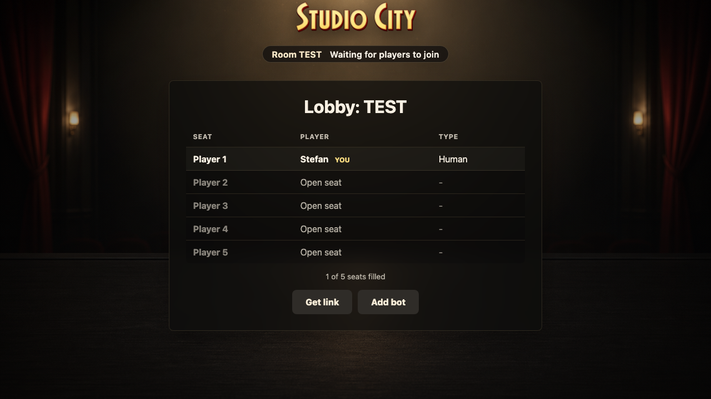
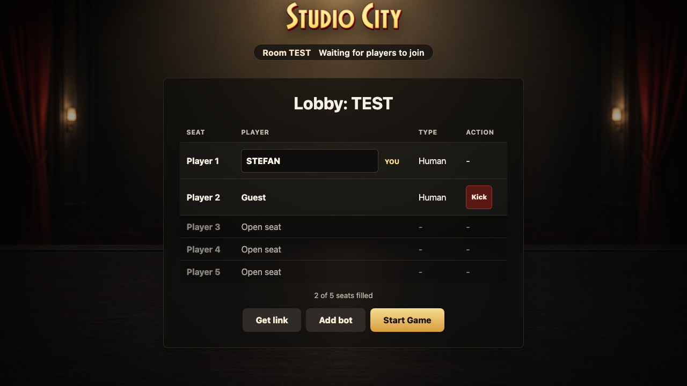
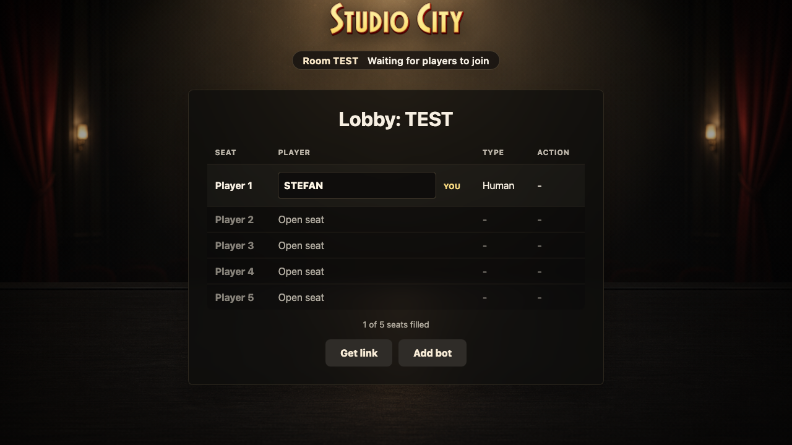
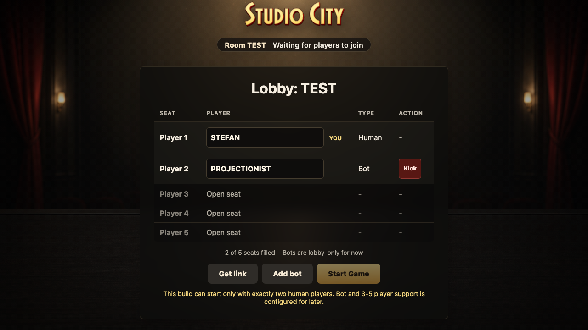

# Room Listener

The room route listens to Firestore emulator actions, auto-joins linked visitors, and renders derived Redux state.

## Host creates a room

### Verifications

- [x] Host appears in the lobby table

## Room link auto-joins a guest

### Verifications

- [x] Guest appears in the lobby table

## Host removes a human player

### Verifications

- [x] Removed guest is no longer seated and sees the removal notice

## Host can reserve and rename a future bot seat

### Verifications

- [x] Bot occupies the reusable lobby seat with the edited name
- [x] Current implementation does not start with a bot

## Host removes a bot from its seat

### Verifications

- [x] Bot seat becomes open again

