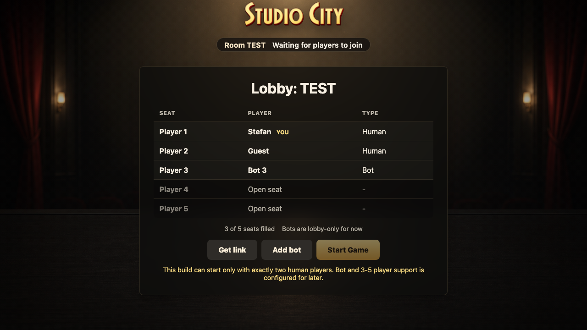

# Room Listener

The room route listens to Firestore emulator actions, auto-joins linked visitors, and renders derived Redux state.

## Host creates a room

### Verifications

- [x] Host appears in the lobby table

## Room link auto-joins a guest

### Verifications

- [x] Guest appears in the lobby table

## Host can reserve a future bot seat

### Verifications

- [x] Bot occupies the next lobby seat
- [x] Current implementation does not start with a bot

